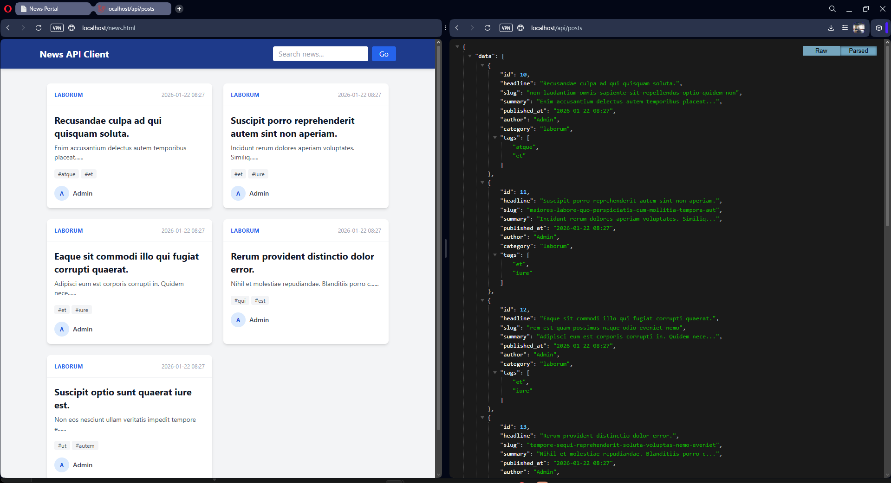
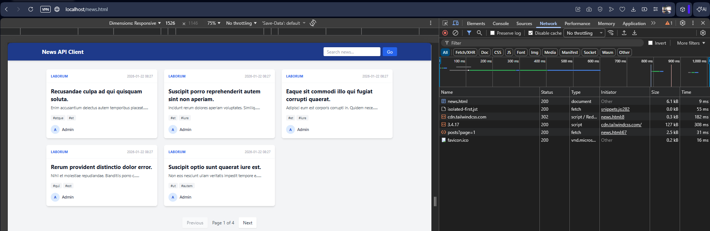

<p align="center"><a href="https://laravel.com" target="_blank"></a></p>
<p align="center"><a href="https://mariadb.org" target="_blank"></a></p>

<p align="center">
# Headless News CMS (Laravel + MariaDB)

## 🚀 Overview
A high-performance, containerized Headless CMS designed for omnichannel content delivery. Built with **Laravel 12**, optimized with **MariaDB Full-Text Search**, and accelerated by **Redis Caching**.

This API serves news content to mobile apps and frontend clients with sub-millisecond response times.

## 🛠 Tech Stack
*   **Framework:** Laravel 12 (API Mode)
*   **Database:** MariaDB (optimized with Full-Text Indexing)
*   **Cache:** Redis (Key-Value Store)
*   **Infrastructure:** Docker (Laravel Sail)
*   **Architecture:** RESTful API / Headless

## 📸 Visual Demo

### 1. The Headless Architecture
*Separation of concerns: The API (Backend) handles logic/data, while the Client (Frontend) handles presentation.*


### 2. Performance (Redis Cache)
*Response times dropped from ~300ms (Database) to <50ms (Redis) on repeated requests.*


### 3. Search Engine
*Native MariaDB Full-Text indexing in action.*


## ⚡ Key Features
*   **Advanced Search:** Implemented MariaDB Native Full-Text search (Natural Language Mode) instead of slow `LIKE` queries.
*   **High Performance:** Implemented Redis caching strategies for hot endpoints (`/api/posts`), reducing DB load by 99% on repeated reads.
*   **Standardized Output:** Uses Laravel API Resources to decouple database schema from JSON output.
*   **Scalable Schema:** Many-to-Many relationships (Posts <-> Tags) via pivot tables.

## 🏃‍♂️ How to Run
1.  **Clone & Install:**
    ```bash
    git clone https://github.com/your-username/headless-news.git
    cd headless-news
    docker run --rm \
        -u "$(id -u):$(id -g)" \
        -v "$(pwd):/var/www/html" \
        -w /var/www/html \
        laravelsail/php84-composer:latest \
        composer install --ignore-platform-reqs
    ```
2.  **Start Containers:**
    ```bash
    ./vendor/bin/sail up -d
    ```
3.  **Setup Database:**
    ```bash
    ./vendor/bin/sail artisan migrate:fresh --seed
    ```
4.  **Test Client:**
    Open `http://localhost/news.html` to view the SPA Frontend.

## 📡 API Endpoints
*   `GET /api/posts` - List latest news (Paginated)
*   `GET /api/posts?search=keyword` - Full-text search through headlines and content
